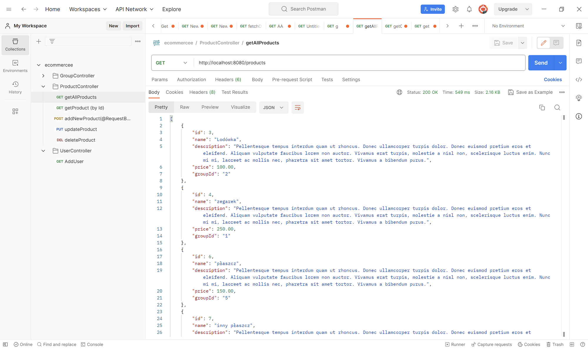

## Projekt grupowy - sklep internetowy
4-tygodniowy projekt grupowy kierowany przez doświadczonego
project managera. Prace polegały na wspólnym uzgodnieniu wersji diagramu ERD, a następnie napisaniu backendu sklepu internetowego. 
Prowadzono prace według narzuconej listy wymaganych endpointów i specyfikacji w plikach json.
Kładziono nacisk na praktyczną naukę GIT i obowiązkowe wzajemne code review.

Projekt prowadzono w metodologii Kanban z wykorzystaniem narzędzia Jira - przydzielanie i wykonywanie tasków, zgłaszanie błędów oraz wzajemna pomoc i wyjaśnienia do poszczególnych zagadnień.
Prowadzono też codzienne DAILY na czacie grupowym, dzięki temu każdy uczestnik projektu wiedział na jakim etapie prac są współpracownicy. 

## Lista endpointów
### products:
- lista wszystkich produktów
- pobranie pojedynczego produktu
- utworzenie produktu
- aktualizacja danych produktu
- usunięcie produktu
### groups (grupy produktów):
- lista wszystkich grup
- dodanie grupy
- wyświetlenie grupy o podanym id
- aktualizacja wybranej grupy
### carts:
- utworzenie pustego koszyka
- pobranie elementów z koszyka
- dodanie elementów (produktów) do koszyka
- usunięcie konkretnego produktu z koszyka
- utworzenie zamówienia na podstawie koszyka
### orders:
- lista wszystkich zamówień
- dodanie nowego zamówienia
- wyświetlenie zamówienia
- aktualizacja zamówienia
- usunięcie zamówienia
### users:
- utworzenie użytkownika
- zablokowanie użytkownika
- wygenerowanie losowego klucza ważnego godzinę po podaniu poprawnych danych użytkownika

Przykładowy JSON z Postmana:

